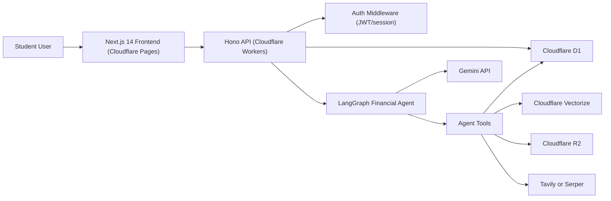

# BurryAI - Complete Implementation Plan (Cloudflare + LangGraph)

This document is the execution roadmap to build BurryAI from the current codebase to production.

It is written for two goals:

1. Build the product in a practical order.
2. Help you learn Cloudflare and LangGraph while building.

---

## 0. Current State Snapshot

### What already exists

- Next.js frontend with landing page, login UI, dashboard UI, AI advisor UI, and charts.
- A basic Cloudflare Worker (`workers/ai-service.ts`) that handles `/api/recommendations`.
- Vectorize + KV seeding script (`scripts/populate-vectordb.ts`) with sample financial data.
- Wrangler config with AI, Vectorize, and KV bindings.

### What is missing for the target product

- No Hono API architecture.
- No D1 schema and no real financial data persistence.
- No Cloudflare-native auth/session system.
- No LangGraph financial agent.
- No production tool system for the agent.
- No Tavily/Serper web retrieval flow.
- No production hardening (rate limit, logging, monitoring).

---

## 0.1 Execution Status (Updated March 10, 2026)

Use this checklist as the live implementation tracker.

- [x] Phase 1 - Cloudflare Infrastructure Setup
- [x] Phase 2 - Authentication and User System
- [x] Phase 3 - Financial Data Layer
- [x] Phase 4 - Financial Analytics Engine
- [x] Phase 5 - Dashboard APIs
- [x] Phase 6 - LangGraph Financial Agent
- [ ] Phase 7 - Tool System
- [ ] Phase 8 - RAG Integration
- [ ] Phase 9 - Web Retrieval
- [ ] Phase 10 - Frontend Integration (remaining advanced modules)
- [ ] Phase 11 - Production Hardening

### Done Now (March 10, 2026)

- Auth routes + JWT sessions (`/auth/signup`, `/auth/login`, `/auth/logout`, `/auth/me`).
- Financial CRUD routes (`POST/GET /expenses`, `POST/GET /loans`) with user-scoped queries.
- Profile/onboarding routes (`GET/PUT /profile`, aliases under `/user/profile`).
- Financial analytics route (`GET /financial-summary`) with deterministic score calculation.
- Dashboard API routes:
  - `GET /dashboard/expense-summary`
  - `GET /dashboard/financial-score`
  - `GET /dashboard/charts`
  - `GET /dashboard/timeline`
- Frontend dashboard wired to real backend data (no profile mock state).
- Onboarding page added and linked from signup flow.
- Login/signup page redesigned and app logout added.
- Phase 6 financial agent pipeline shipped:
  - `POST /agent/advice` (+ `/api/agent/advice`) with authenticated user context.
  - Backend-only Gemini integration with model fallback and deterministic rule fallback.
  - Agent metadata logging to `ai_logs` (`query`, `response`, `model_used`).
  - Dashboard AI Advisor frontend now calls backend agent endpoint (no browser Gemini key usage).
- Worker deployed: `https://burryai-worker.mdmurtuzaali777.workers.dev`
- D1 migrations applied locally and remotely up through `0002_user_profiles.sql`.

### Deployment Timing Guidance

- Deploy Worker now after Phases 2-4 whenever API schema changes are complete and tested.
- Deploy frontend to production after Phase 5 (dashboard APIs) minimum, so dashboard widgets are fully backend-driven.
- Do final "stable production" deployment only after Phase 11 hardening tasks are complete.

---

## 1. Learning Primer (Cloudflare + LangGraph)

Use this as a quick guide while implementing.

### Cloudflare Services (beginner explanation)

- **Cloudflare Pages**
  - What it is: frontend hosting for your Next.js app.
  - Why we use it: global edge delivery and direct Cloudflare ecosystem integration.

- **Cloudflare Workers**
  - What it is: serverless backend runtime at the edge.
  - Why we use it: fast APIs, good for stateless request handling, integrates with D1/Vectorize/R2.

- **Cloudflare D1**
  - What it is: SQLite-based SQL database managed by Cloudflare.
  - Why we use it: relational data for users, expenses, loans, and analytics.

- **Cloudflare Vectorize**
  - What it is: vector database for semantic search (embeddings).
  - Why we use it: RAG retrieval of financial knowledge and related context.

- **Cloudflare R2**
  - What it is: object storage for files/documents.
  - Why we use it: store knowledge docs, chunk files, optional reports or exports.

- **Wrangler**
  - What it is: CLI tool to develop/deploy Workers, manage D1 migrations, bindings, and secrets.
  - Why we use it: it is your control panel from terminal.

### LangGraph (beginner explanation)

- **What it is**
  - A framework to build multi-step AI agents as a graph of nodes.

- **Why use it**
  - Instead of a single prompt, you define structured reasoning steps:
    - detect intent
    - fetch user context
    - call tools
    - retrieve knowledge
    - generate final answer

- **Core concepts**
  - **State**: shared object that moves through nodes.
  - **Node**: one function that reads/writes state.
  - **Edge**: routing between nodes.
  - **Tool**: typed function the model can call (for real data actions).

---

## 2. Target Cloudflare-Only Architecture



---

## 3. Phase-by-Phase Plan (with Why + Beginner Steps)

Each phase contains:

- Goal
- Why this phase matters
- Beginner-friendly build steps
- Cloudflare/LangGraph learning outcomes
- Deliverables

---

### Phase 1 - Cloudflare Infrastructure Setup

#### Goal

Create a stable Cloudflare development and deployment foundation before feature work.

#### Why this phase matters

If infrastructure is not correct, every next phase breaks. This phase removes confusion by setting one deployment model: Pages + Workers + D1 + Vectorize (+ R2 optional).

#### Beginner build steps

1. Install and login:
   - `npm install`
   - `npx wrangler login`
2. Prepare Worker API structure with Hono:
   - `workers/src/index.ts`
   - `workers/src/routes/health.ts`
3. Create/update wrangler bindings:
   - D1 binding
   - Vectorize binding
   - R2 binding (optional now)
4. Add initial health route:
   - `GET /health` returns `{ ok: true, env: "dev" }`
5. Configure frontend API base URL from env, remove hardcoded worker URL.
6. Run local:
   - frontend: `npm run dev`
   - worker: `npm run dev:worker`

#### Cloudflare learning outcome

- Understand Wrangler workflow, bindings, local worker dev, and Pages-Worker integration.

#### Deliverables

- Working local cloudflare-style environment.
- Health route reachable from frontend.

---

### Phase 2 - Authentication and User System

#### Goal

Implement secure user registration/login/session and profile storage without Firebase dependency.

#### Why this phase matters

Every financial record and AI response must be tied to a real user. Auth is the identity backbone.

#### Beginner build steps

1. Create D1 tables:
   - `users`
   - `financial_profiles`
2. Add auth routes in Worker:
   - `POST /auth/signup`
   - `POST /auth/login`
   - `POST /auth/logout`
   - `GET /auth/me`
3. Implement password hashing and JWT session handling.
4. Add auth middleware to protect private routes.
5. Replace frontend Firebase auth calls with backend auth endpoints.
6. Store session token securely (HTTP-only cookie recommended).

#### Cloudflare learning outcome

- Learn D1 CRUD basics and how Worker middleware secures endpoints.

#### Deliverables

- Signup/login flow works.
- Authenticated requests succeed.

---

### Phase 3 - Financial Data Layer

#### Goal

Persist student financial data and expose core APIs for expenses, income context, and loans.

#### Why this phase matters

Without real data, all analytics and agent reasoning are fake. This phase turns UI into a real app.

#### Beginner build steps

1. Create D1 tables:
   - `expenses`
   - `loans`
2. Implement APIs:
   - `POST /expenses`
   - `GET /expenses`
   - `POST /loans`
   - `GET /loans`
3. Reuse `financial_profiles.monthly_income` for initial income tracking.
4. Validate all inputs using Zod.
5. Add user-scoped queries (`WHERE user_id = ?`) to prevent data leakage.

#### Cloudflare learning outcome

- Learn SQL schema design in D1 and secure user-scoped data access patterns.

#### Deliverables

- Working financial CRUD APIs with real D1 persistence.

---

### Phase 4 - Financial Analytics Engine

#### Goal

Create reusable analytics services and expose `GET /financial-summary`.

#### Why this phase matters

Dashboard insights should come from deterministic formulas, not random or mocked frontend logic.

#### Beginner build steps

1. Build analytics service:
   - total income
   - total expenses
   - remaining balance
   - expense ratio
   - financial health score
2. Expose `GET /financial-summary`.
3. Keep formulas centralized in one module for easier tuning later.
4. Add unit tests for score calculations.

#### Cloudflare learning outcome

- Learn to combine D1 query results with business logic services in Workers.

#### Deliverables

- Dashboard can consume reliable financial summary API.

---

### Phase 5 - Dashboard APIs

#### Goal

Provide all backend endpoints required by dashboard widgets/charts/timeline.

#### Why this phase matters

Frontend should stop doing heavy calculations by itself. Backend should provide clean view-model APIs.

#### Beginner build steps

1. Add dashboard routes:
   - `GET /dashboard/expense-summary`
   - `GET /dashboard/financial-score`
   - `GET /dashboard/charts`
   - `GET /dashboard/timeline`
2. Build aggregation queries in D1 for categories and monthly trends.
3. Return response shapes optimized for Recharts components.

#### Cloudflare learning outcome

- Learn API design for frontend analytics consumption.

#### Deliverables

- All dashboard panels powered by backend endpoints.

---

### Phase 6 - LangGraph Financial Agent

#### Goal

Build the core agentic financial advisor using LangGraph on Worker backend.

#### Why this phase matters

This is the product brain. It turns static analytics into adaptive, user-specific recommendations.

#### Beginner build steps

1. Define agent state schema.
2. Implement graph nodes:
   - intent detection
   - context builder
   - tool selection
   - response generation
3. Integrate Gemini API from backend only.
4. Create endpoint:
   - `POST /agent/advice`
5. Log request/response metadata into `ai_logs`.

#### LangGraph learning outcome

- Learn how state flows through nodes and how controlled reasoning is better than one-shot prompting.

#### Deliverables

- Working advisor endpoint using LangGraph graph execution.

---

### Phase 7 - Tool System

#### Goal

Implement typed tools used by the LangGraph agent.

#### Why this phase matters

Tools are how the AI interacts with real finance data. No tools means no trustworthy actions.

#### Beginner build steps

1. Implement tools:
   - `getFinancialProfile`
   - `getExpenses`
   - `costCutter`
   - `financialHealth`
   - `loanOptimizer`
2. Add tool registry with Zod input/output schema.
3. Connect tool calls to LangGraph node execution.
4. Add tests for tool functions.

#### LangGraph learning outcome

- Learn tool calling architecture and how to keep tool calls deterministic and auditable.

#### Deliverables

- Agent can fetch data and compute actionable finance recommendations.

---

### Phase 8 - RAG Integration

#### Goal

Add knowledge retrieval using Vectorize for grounded financial guidance.

#### Why this phase matters

Agent should not rely only on model memory. RAG improves relevance and reduces hallucination.

#### Beginner build steps

1. Expand financial knowledge base (budgeting, debt strategy, student finance tips).
2. Chunk documents and create embeddings.
3. Upsert embeddings to Vectorize and metadata to R2 or D1.
4. Add retrieval service:
   - semantic query
   - top-k results
   - source metadata
5. Inject retrieved context in LangGraph response node.

#### Cloudflare learning outcome

- Learn Vectorize indexing, retrieval flow, and grounded response design.

#### Deliverables

- Agent can answer with internal knowledge-backed recommendations.

---

### Phase 9 - Web Retrieval (Tavily or Serper)

#### Goal

Enable extra earning recommendations using live web search + summarization.

#### Why this phase matters

Opportunities change frequently; static knowledge is not enough for side hustles and gigs.

#### Beginner build steps

1. Implement web search provider adapter (Tavily or Serper).
2. Extract and normalize useful results (title, url, summary, freshness).
3. Add summarization step using Gemini.
4. Include citations in final agent response.
5. Cache search results for cost control and speed.

#### Learning outcome

- Learn hybrid retrieval: internal RAG + external real-time search.

#### Deliverables

- Agent can return current earning opportunities with sources.

---

### Phase 10 - Frontend Integration

#### Goal

Connect all UI modules to real backend APIs and agent endpoints.

#### Why this phase matters

This phase converts the current UI-first prototype into a full working product.

#### Beginner build steps

1. Replace dashboard mock state with API client calls.
2. Connect onboarding/profile forms to backend auth + profile APIs.
3. Connect expense and loan forms to CRUD APIs.
4. Connect AI chat to `/agent/advice` endpoint.
5. Use Recharts for final analytics visualizations as per target stack.

#### Learning outcome

- Learn frontend-backend contract handling and typed API client patterns.

#### Deliverables

- End-to-end working frontend on Cloudflare Pages.

---

### Phase 11 - Production Hardening

#### Goal

Make the system secure, observable, and stable for real users.

#### Why this phase matters

A feature-complete app can still fail in production without guardrails.

#### Beginner build steps

1. Add centralized error handling and structured logs.
2. Add rate limiting for auth and agent endpoints.
3. Add response caching for expensive analytics/search calls.
4. Add monitoring dashboards and alert rules.
5. Add smoke tests and deployment checklist.

#### Cloudflare learning outcome

- Learn production practices in edge environments: reliability, observability, and abuse prevention.

#### Deliverables

- Stable production-ready release.

---

## 4. Recommended Backend Folder Layout

Use this structure as you implement phases:

```text
workers/
  src/
    index.ts
    routes/
      health.ts
      auth.ts
      users.ts
      expenses.ts
      loans.ts
      dashboard.ts
      financial-summary.ts
      agent.ts
    middleware/
      auth.ts
      error-handler.ts
      rate-limit.ts
    db/
      client.ts
      repositories/
    services/
      analytics.service.ts
      dashboard.service.ts
      auth.service.ts
    agent/
      state.ts
      graph.ts
      nodes/
    tools/
      index.ts
      getFinancialProfile.ts
      getExpenses.ts
      costCutter.ts
      financialHealth.ts
      loanOptimizer.ts
    rag/
      ingest.ts
      retrieve.ts
    web/
      search.provider.ts
      summarize.ts
  migrations/
```

---

## 5. Suggested Timeline

- Week 1: Phase 1
- Week 2: Phase 2 and Phase 3
- Week 3: Phase 4 and Phase 5
- Week 4: Phase 6 and Phase 7
- Week 5: Phase 8 and Phase 9
- Week 6: Phase 10 and Phase 11

---

## 6. Beginner "What to Do Next" Checklist

Start with these exact steps:

1. Set Cloudflare resources first (D1, Vectorize, Worker bindings, Pages project).
2. Build Hono Worker with `/health`.
3. Add D1 migrations and verify schema locally.
4. Implement auth routes and middleware.
5. Implement expenses/loans routes.
6. Build `/financial-summary` and dashboard APIs.
7. Build LangGraph agent with minimal tools.
8. Add Vectorize RAG.
9. Add Tavily/Serper retrieval.
10. Connect all frontend tabs to APIs.
11. Add logging/rate-limit/testing and deploy production.

---

## 7. Important Rules for This Project

- Cloudflare-only deployment: no Vercel.
- Keep Gemini API keys on backend only.
- Validate all inputs with Zod.
- Keep agent responses grounded with tools + retrieval.
- Every phase must end with testable deliverables.
