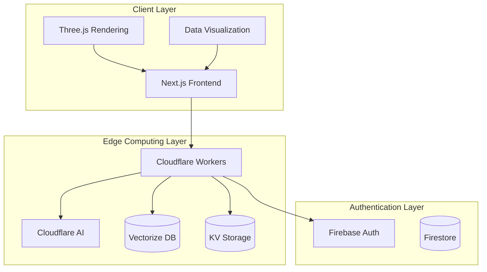
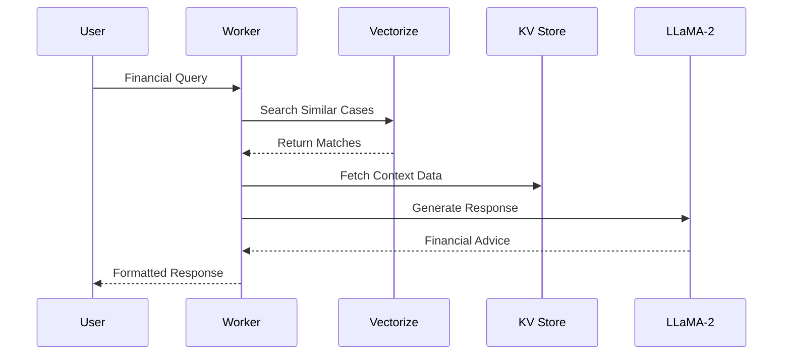
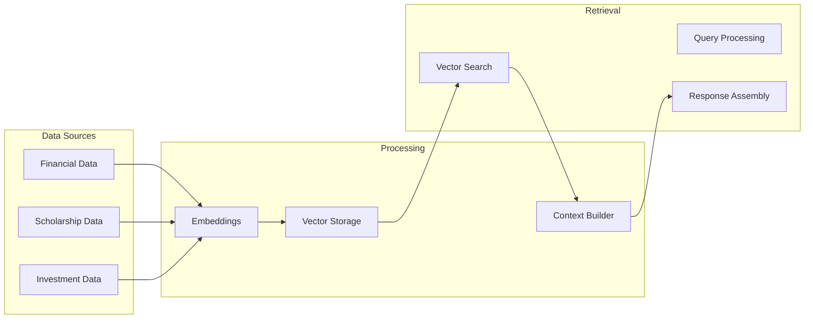
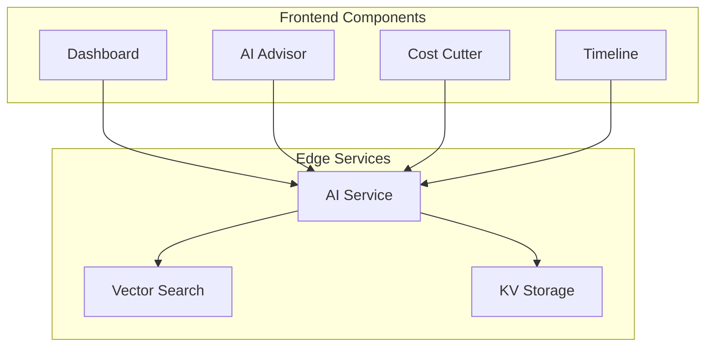

# **SmartFinance.AI**  
### *AI-Powered Student Finance Management*  

SmartFinance.AI is an intelligent financial management platform designed specifically for students, leveraging AI to provide personalized financial guidance, loan management, and expense optimization.

---

## 🌟 **Key Features**

### **1. AI Financial Advisor**
- Personalized financial health analysis  
- Smart spending recommendations  
- Foreign country cost-of-living adjustments  
- Loan repayment optimization  
- Government grants and aid suggestions  
- Investment opportunities (stocks, crypto)  
- Extra earning recommendations  

### **2. Financial Timelines**
- Comprehensive cash flow visualization  
- Loan payment deadline tracking  
- Income stream monitoring  
- Expense tracking  
- Investment return projections  

### **3. Cost Cutter**
- AI-powered expense optimization  
- Unnecessary cost identification  
- Smart budgeting recommendations  
- Location-based cost analysis  

### **4. Financial Insights**
- Interactive data visualizations  
- Cash flow analytics  
- Expense pattern analysis  
- Savings projections  
- Risk assessment metrics  

---

## 🛠️ **Technology Stack**

### **Frontend**
- **Next.js 14** (App Router)  
- **TypeScript**  
- **Tailwind CSS**  
- **Framer Motion**  
- **Three.js** (3D visualizations)  
- **Chart.js** (Data visualization)  

### **Backend**
- **Cloudflare Workers**  
- **Vector Database** (Cloudflare Vectorize)  
- **KV Storage**  
- **Firebase** (Auth & Firestore)  

### **AI/ML**
- **RAG** (Retrieval-Augmented Generation)  
- **Cloudflare AI Models**:
  - `@cf/meta/llama-2-7b-chat-int8` (Financial advice)  
  - `@cf/baai/bge-base-en-v1.5` (Embeddings)  

---

## 🏗️ **System Architecture**

### **High-Level System Design**



### **RAG Implementation Flow**



### **Data Processing Pipeline**



### **Component Architecture**



---

## 🚀 **Deployment**

### **Prerequisites**
- Node.js 18+
- Cloudflare Account
- Firebase Account
- Environment Variables Setup

### **Local Development**
```bash
# Install dependencies
npm install

# Run development server
npm run dev

# Run tests
npm test

# Build for production
npm run build
```

### **Environment Variables**
Create a `.env.local` file with:
```bash
CLOUDFLARE_API_TOKEN=your_token
FIREBASE_CONFIG=your_config
NEXT_PUBLIC_APP_URL=http://localhost:3000
```

### **Production Deployment**
1. Fork this repository
2. Configure environment variables in Cloudflare Dashboard
3. Deploy using Cloudflare Pages:
```bash
npm run deploy
```

---

## 🤝 **Contributing**

We welcome contributions! Please follow these steps:

1. Fork the repository
2. Create a feature branch (`git checkout -b feature/AmazingFeature`)
3. Commit changes (`git commit -m 'Add AmazingFeature'`)
4. Push to branch (`git push origin feature/AmazingFeature`)
5. Open a Pull Request

### **Development Guidelines**
- Follow TypeScript best practices
- Write tests for new features
- Update documentation as needed
- Follow the existing code style

---

## 📝 **License**

This project is licensed under the MIT License - see the [LICENSE](LICENSE) file for details.

---

## 🙏 **Acknowledgments**

- Cloudflare for their AI and edge computing platform
- Firebase for authentication and database services
- The open-source community for inspiration and tools
